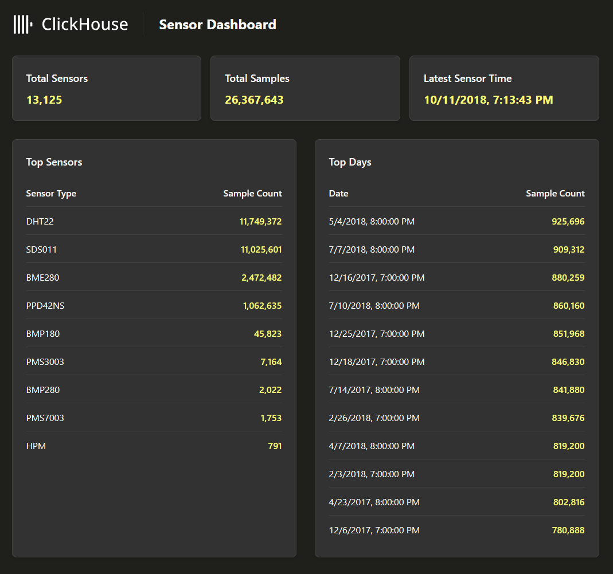

# ClickHouse.Driver .NET Example App

A C# demo app for using [ClickHouse.Driver](https://github.com/ClickHouse/clickhouse-cs) v1.0.0 in .NET.

Most queries use the `ClickHouseClient` API directly (`ExecuteScalarAsync`, `ExecuteReaderAsync`), while one query demonstrates Dapper ORM integration via `client.CreateConnection()`.

The app renders a single HTML page and uses JSON API calls to refresh the data multiple times per second.

The data set used is based on the [Environmental Sensors Data](https://clickhouse.com/docs/getting-started/example-datasets/environmental-sensors) example dataset for [ClickHouse](https://github.com/ClickHouse/ClickHouse).



## Quick Start

```bash
docker compose up -d
```

This starts ClickHouse and the API. The app will be available at `http://localhost:8080`.

To stop:

```bash
docker compose down
```

## Running Locally

If you already have a ClickHouse instance running, you can run the API directly:

```bash
dotnet run --project ClickHouse.API
```

The default connection is `localhost:8123` with user `default` and no password. Override via environment variables:

```bash
export ClickHouse__Host=my-clickhouse-server
export ClickHouse__Port=8123
export ClickHouse__Username=default
export ClickHouse__Password=secret
```

## Loading Data

The dashboard starts empty. To load sample data, open the ClickHouse Play UI at [http://localhost:8123/play](http://localhost:8123/play) and run:

```sql
INSERT INTO sensors
    SELECT *
    FROM s3(
        'https://clickhouse-public-datasets.s3.amazonaws.com/sensors/monthly/2019-06_bme280.csv.zst',
        'CSVWithNames',
        $$ sensor_id UInt16,
        sensor_type String,
        location UInt32,
        lat Float32,
        lon Float32,
        timestamp DateTime,
        P1 Float32,
        P2 Float32,
        P0 Float32,
        durP1 Float32,
        ratioP1 Float32,
        durP2 Float32,
        ratioP2 Float32,
        pressure Float32,
        altitude Float32,
        pressure_sealevel Float32,
        temperature Float32,
        humidity Float32 $$
    )
SETTINGS
    format_csv_delimiter = ';',
    input_format_allow_errors_ratio = '0.5',
    input_format_allow_errors_num = 10000,
    input_format_parallel_parsing = 0,
    date_time_input_format = 'best_effort';
```

This loads ~13 million BME280 sensor readings from June 2019. To load more data, replace the file name with a different month or sensor type (files follow the pattern `YYYY-MM_sensortype.csv.zst`). See the full [Environmental Sensors Data](https://clickhouse.com/docs/getting-started/example-datasets/environmental-sensors) guide for details.
